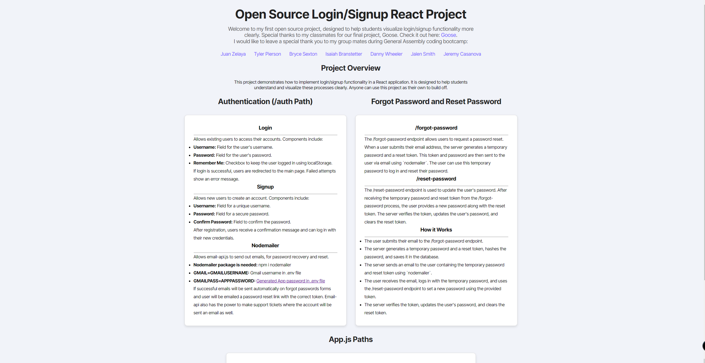
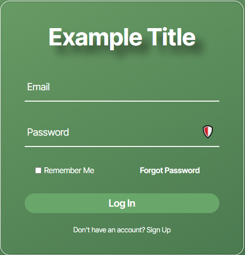
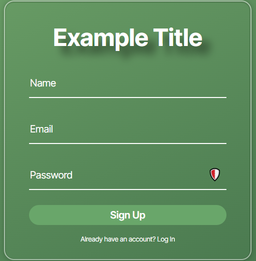
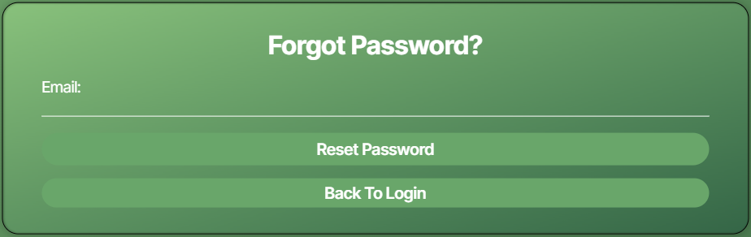
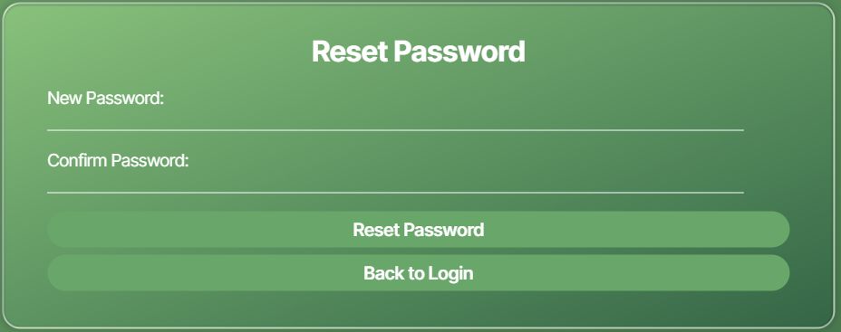
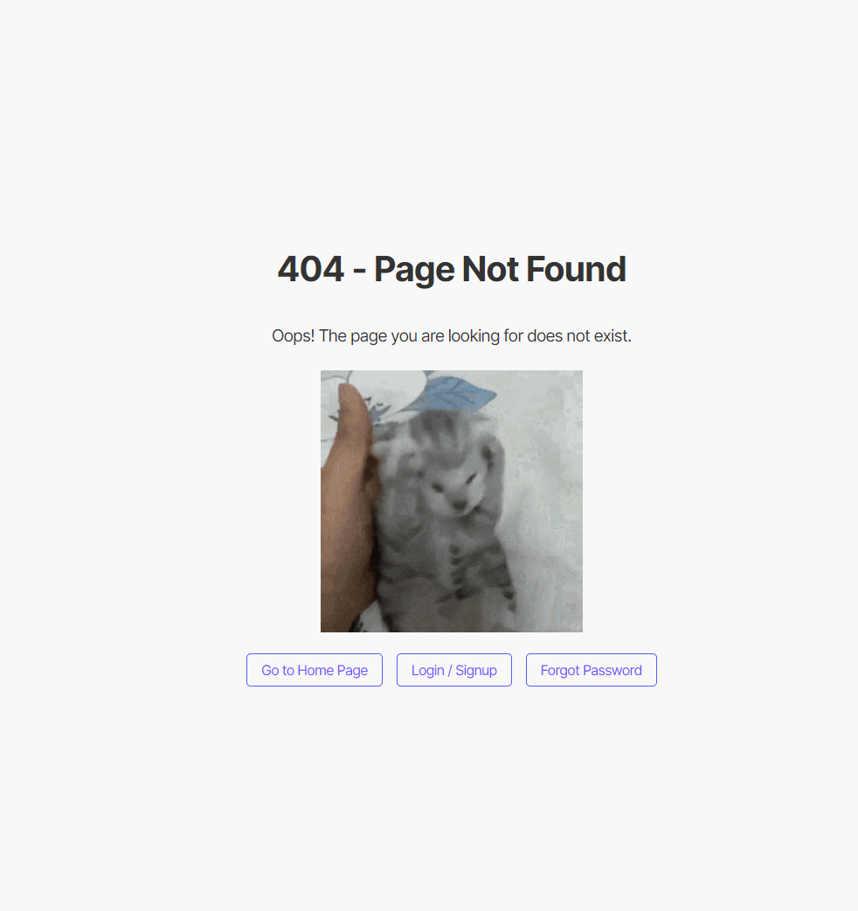

# Open Source Login/Signup React Project

Welcome to my first open source project, designed to help students visualize login/signup functionality more clearly. Special thanks to my classmates for our final project, Goose. Check it out here: [Goose](https://goose.danwheeler.me).

I would like to leave a special thank you to my group mates during General Assembly coding bootcamp:
- [Juan Zelaya](https://github.com/zjuan4101)
- [Tyler Pierson](https://github.com/tylerpierson)
- [Bryce Sexton](https://github.com/brycesexton/)
- [Isaiah Branstetter](https://github.com/Kennyi00/)
- [Danny Wheeler](https://github.com/dwheeler7)
- [Jalen Smith](https://github.com/jalensmith17)
- [Jeremy Casanova](https://github.com/Jcasanova1990)

## Project Overview

This project demonstrates how to implement login/signup functionality in a React application. It is designed to help students understand and visualize these processes clearly. Anyone can use this project as their own to build upon.

## Authentication (/auth Path)

### Login

Allows existing users to access their accounts. Components include:
- **Username:** Field for the user's username.
- **Password:** Field for the user's password.
- **Remember Me:** Checkbox to keep the user logged in using localStorage.

If login is successful, users are redirected to the main page. Failed attempts show an error message.

### Signup

Allows new users to create an account. Components include:
- **Username:** Field for a unique username.
- **Password:** Field for a secure password.
- **Confirm Password:** Field to confirm the password.

After registration, users receive a confirmation message and can log in with their new credentials.

### Nodemailer

Allows `email-api.js` to send out emails for password recovery and reset.

Requirements:
- **Nodemailer package:** `npm i nodemailer`
- **GMAIL=GMAILUSERNAME:** Gmail username in `.env` file
- **GMAILPASS=APPPASSWORD:** [Generated App password](https://myaccount.google.com/apppasswords) in `.env` file

If successful, emails will be sent automatically on forgot password forms and the user will be emailed a password reset link with the correct token. `email-api` also has the power to make support tickets where the account will be sent an email as well.

## Forgot Password and Reset Password

### /forgot-password

The `/forgot-password` endpoint allows users to request a password reset. When a user submits their email address, the server generates a temporary password and a reset token. This token and password are then sent to the user via email using `nodemailer`. The user can use this temporary password to log in and reset their password.

### /reset-password

The `/reset-password` endpoint is used to update the user's password. After receiving the temporary password and reset token from the `/forgot-password` process, the user provides a new password along with the reset token. The server verifies the token, updates the user's password, and clears the reset token.

### How it Works

1. The user submits their email to the `/forgot-password` endpoint.
2. The server generates a temporary password and a reset token, hashes the password, and saves it in the database.
3. The server sends an email to the user containing the temporary password and reset token using `nodemailer`.
4. The user receives the email, logs in with the temporary password, and uses the `/reset-password` endpoint to set a new password using the provided token.
5. The server verifies the token, updates the user's password, and clears the reset token.

## App.js Paths

### /auth

The base endpoint for authentication:
- **/auth:** Authentication page. Signup/Login here.
- **/auth/forgot-password:** Forgot password page.
- **/auth/reset-password/:token:** Reset password page.

### /profile/:userId

- **/profile/:userId:** User profile page.

### /*

- **/NotFound:** Custom 404 NotFound Page

